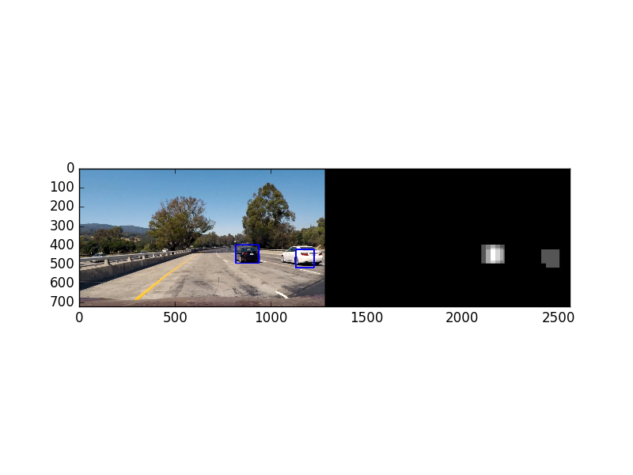

# Vehicle Detection

Vehicle detection is an important process in any
autonomous
driving pipeline. Once the vehicles are identified they can be used to
plan how
an autonomous vehicle will navigate an enviornment. This will be a tutorial on
how to implement a vehicle identifier algorithm using sklearn and OpenCV. The
steps of this algortihm are:

* Perform feature extraction on a labeled training
set of images and train a classifier.
* Implement a sliding-window technique and
use our trained classifier to search for vehicles in images.
* Run our pipeline
on a video stream and create a heat map of recurring detections frame by frame
to reject outliers and follow detected vehicles.

# Feature Extraction

The first and arguably most important part of a machine
learning pipeline is the extraction of good features that proved a rich
representation of our objects of interest. We want our classifier to be able to
detect cars so we shall use the following features:

* A histogram of oriented
gradients (HOG) for each channel.
* A histgram of each color channel.
* A
spatial bin of each color channel.

```python
import numpy as np
import cv2
from skimage.feature import hog

def get_hog_features(img, orient, pix_per_cell, cell_per_block,feature_vec=True):

    features = hog(img, orientations=orient,
                   pixels_per_cell=(pix_per_cell, pix_per_cell),
                   cells_per_block=(cell_per_block, cell_per_block),
                   transform_sqrt=True,
                   visualise=False, feature_vector=feature_vec)
    return features

def color_hist(img, nbins=32):
    channel1_hist = np.histogram(img[:,:,0], bins=nbins)
    channel2_hist = np.histogram(img[:,:,1], bins=nbins)
    channel3_hist = np.histogram(img[:,:,2], bins=nbins)
    hist_features = np.concatenate([channel1_hist[0], channel2_hist[0], channel3_hist[1]])
    return hist_features

def bin_spatial(img, size=(32,32)):
    channel1 = cv2.resize(img[:,:,0], size).ravel()
    channel2 = cv2.resize(img[:,:,1], size).ravel()
    channel3 = cv2.resize(img[:,:,2], size).ravel()
    return np.hstack((channel1, channel2, channel3))
```

For our implemetation we have chosen the following parameters for feature
extraction:
* Convert from RGB color space to YCrCb color space
* HOG: 8
oreintation bins, (8,8) pixels pers cell, and 2 cells per block
* Spatial
binning dimenstions: (32,32)
* Color Histogram: 32 histogram bins

These
parameters were chosen after tuning on multiple test images and seeing which
produced the best ratio of true postitives to false positives. Below is an
illustration of how HOG differentiates between car and non-car images.

---
<figure>
<p align="center">
 
</p>
</figure>

# Classifier Training

When it comes to choosing a classifier there are a variety of options. Linear
Support Vector Machines (SVM) have been shown to work pretty well with HOG
features so we'll try that one. As always we split our data into a training and
test sets and train on the training set. One feature of SVMs is that they also
have a "decision_function" method which can be interpreted as the confidence of
our classifier this will be important when we use our classifier to classify new
images.

Also before we train our classifier it is important to normalize our
features. We do this so that one feature doesnt dominate the others because it
just happens to have a broader scale.

```python
from sklearn.svm import LinearSVC
from sklearn.preprocessing import StandardScaler
from sklearn.model_selection import train_test_split

X = np.vstack((car_features, notcar_features)).astype(np.float64)
# Fit a per-column scaler
X_scaler = StandardScaler().fit(X)
# Apply the scaler to X
scaled_X = X_scaler.transform(X)

# Define the labels vector
y = np.hstack((np.ones(len(car_features)), np.zeros(len(notcar_features))))

rand_state = np.random.randint(0, 100)
X_train, X_test, y_train, y_test = train_test_split(
    scaled_X, y, test_size=0.2, random_state=rand_state)

svc = LinearSVC()
svc.fit(X_train, y_train)
```

# Search Windows
Now that our classifier is trained we want to classify images
in our video stream. To do that we will subsample each image in a region of
interest to us into different window sizes and feed them into our classfiier.
We'll use 64x64 and 96x96 windows with a bit of overlap as shown below:

<figure>
<p align="center">
 
</p>
</figure>

What we will find when we test on images is that we get some false positives. We
can do a few things to alleviate this problem. One thins is using the
"decision_function" from before and thresholding on the returned value. Another
thing to notice is that a vehicles will be matched in multiple windows in the
image. We can define a heat map of these windows and use a threshold to get rid
of isolated windows which usually correspond to false positives. Once we have a
thresholded heat map we can use a function in scipy called "label" to find the
connected regions in our heat map.

```python
from scipy.ndimage.measurements import label

def draw_labeled_bboxes(img, labels):

    for car_number in range(1, labels[1]+1):

        nonzero = (labels[0] == car_number).nonzero()

        nonzeroy = np.array(nonzero[0])
        nonzerox = np.array(nonzero[1])

        bbox = ((np.min(nonzerox), np.min(nonzeroy)), (np.max(nonzerox), np.max(nonzeroy)))

        cv2.rectangle(img, bbox[0], bbox[1], (0,0,255),6)

    return img

def process_image(img_src, vis_heat=False):

    draw_img = np.copy(img_src)
    scales = [1,1.5]
    img_src = img_src.astype(np.float32)/255
    heat_map = np.zeros_like(img_src[:,:,0])

    img_src = cv2.cvtColor(img_src, cv2.COLOR_RGB2YCrCb)
    img_cropped = img_src[y_start_stop[0]:y_start_stop[1],:,:]

    for scale in scales:
        if scale != 1:
            imshape = img_cropped.shape
            img_cropped = cv2.resize(img_cropped, (np.int(imshape[1]/scale), np.int(imshape[0]/scale)))

        ch1 = img_cropped[:,:,0]
        ch2 = img_cropped[:,:,1]
        ch3 = img_cropped[:,:,2]

        nxblocks = (ch1.shape[1]//pix_per_cell) - 1
        nyblocks = (ch1.shape[0]//pix_per_cell) - 1
        window = 64
        nblock_per_window = (window // pix_per_cell) - 1
        cells_per_step = 2
        nxsteps = (nxblocks - nblock_per_window) // cells_per_step
        nysteps = (nyblocks - nblock_per_window) // cells_per_step

        hog1 = get_hog_features(ch1, orient, pix_per_cell, cell_per_block, feature_vec=False)
        hog2 = get_hog_features(ch2, orient, pix_per_cell, cell_per_block, feature_vec=False)
        hog3 = get_hog_features(ch3, orient, pix_per_cell, cell_per_block, feature_vec=False)

        for xb in range(nxsteps):
            for yb in range(nysteps):

                test_features = []
                ypos = yb*cells_per_step
                xpos = xb*cells_per_step
                xleft = xpos*pix_per_cell
                ytop = ypos*pix_per_cell

                subimg = cv2.resize(img_cropped[ytop:ytop+window, xleft:xleft+window], (64,64))
                spatial_features = bin_spatial(subimg, size=spatial_size)
                test_features.append(spatial_features)
                hist_features = color_hist(subimg, nbins=hist_bins)
                test_features.append(hist_features)

                hog_feat1 = hog1[ypos:ypos+nblock_per_window, xpos:xpos+nblock_per_window].ravel()
                hog_feat2 = hog2[ypos:ypos+nblock_per_window, xpos:xpos+nblock_per_window].ravel()
                hog_feat3 = hog3[ypos:ypos+nblock_per_window, xpos:xpos+nblock_per_window].ravel()
                hog_features = np.hstack((hog_feat1, hog_feat2, hog_feat3))
                test_features.append(hog_features)

                test_features = np.concatenate(test_features)
                test_features = X_scaler.transform(test_features)

                test_prediction = svc.decision_function(test_features)

                if test_prediction > 0.75:
                    xbox_left = np.int(xleft*scale)
                    ytop_draw = np.int(ytop*scale)
                    win_draw = np.int(window*scale)
                    heat_map[ytop_draw+y_start_stop[0]:ytop_draw+y_start_stop[0]+win_draw,xbox_left:xbox_left+win_draw] += 1

    heat_map[heat_map <= 1] = 0
    labels = label(heat_map)
    draw_img = draw_labeled_bboxes(draw_img, labels)

```

Here is a visualization of our heat map and we can clearly see that areas of
high intensity correspond to vehicles.
<figure>
<p align="center">
 
</p>
</figure>

# Video Implementation

We run this pipeline on each image in our video stream
to get this final result.

[](https://www.youtube.com/watch?v=DKyayI2gE2M)
One extra thing I did for our video stream is that I used the heat maps of
previous images to get stable boxes around the vehicles. I kept a buffer of 10
heat maps which I summed and thresholded.

# Discussion

The algortihm successfully identifying vehicles when they are in range however
there is much room for improvement. For future work one could: 
* Create a
vehicle class and keep track of which pixels are associated with which vehicles.
* A pitfall of the current algortihm is that the classifier was not trained on
different weather conditions and that may make it act unpredictably. 
* The
algorithm can also be further trained to differentiate between vehicle types.
